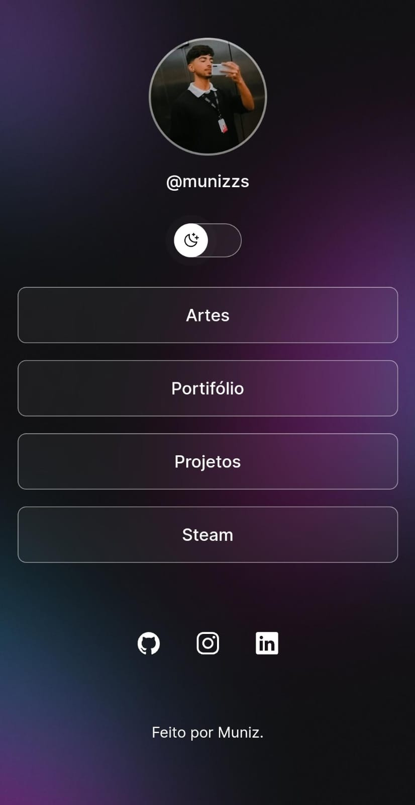

# Projeto Links

|  | Este é um projeto que desenvolvi utilizando HTML, CSS e JavaScript. Ele consiste em uma tela com botões que contêm links personalizados e a funcionalidade de alternar entre os temas claro e escuro. |
|-------------------------------------------------|-----------------------------------------------------------------------------------------------------------------------------------------------------------|

 

## Funcionalidades

- **Botões com Links Personalizados**: Cada botão na tela possui um link configurado que redireciona para diferentes URLs.
- **Alternância de Tema**: Permite alternar entre o tema claro e o tema escuro.

 

## Tecnologias

Esse projeto foi desenvolvido com as seguintes tecnologias:

- HTML e CSS
- JavaScript
- Git e Github
- Figma

  #
  Projeto feito com curso da rocketseat.

  #

  Link: https://munizzs.github.io/ProjetoLinks/
